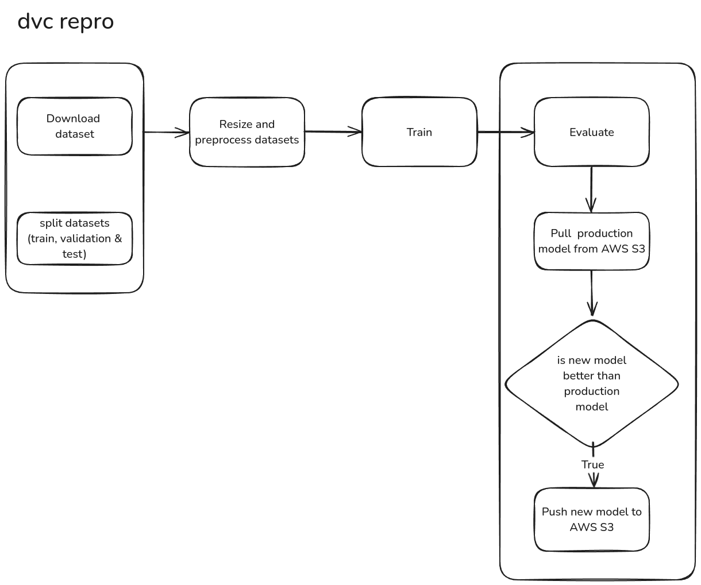
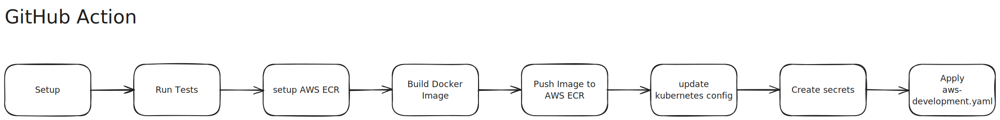
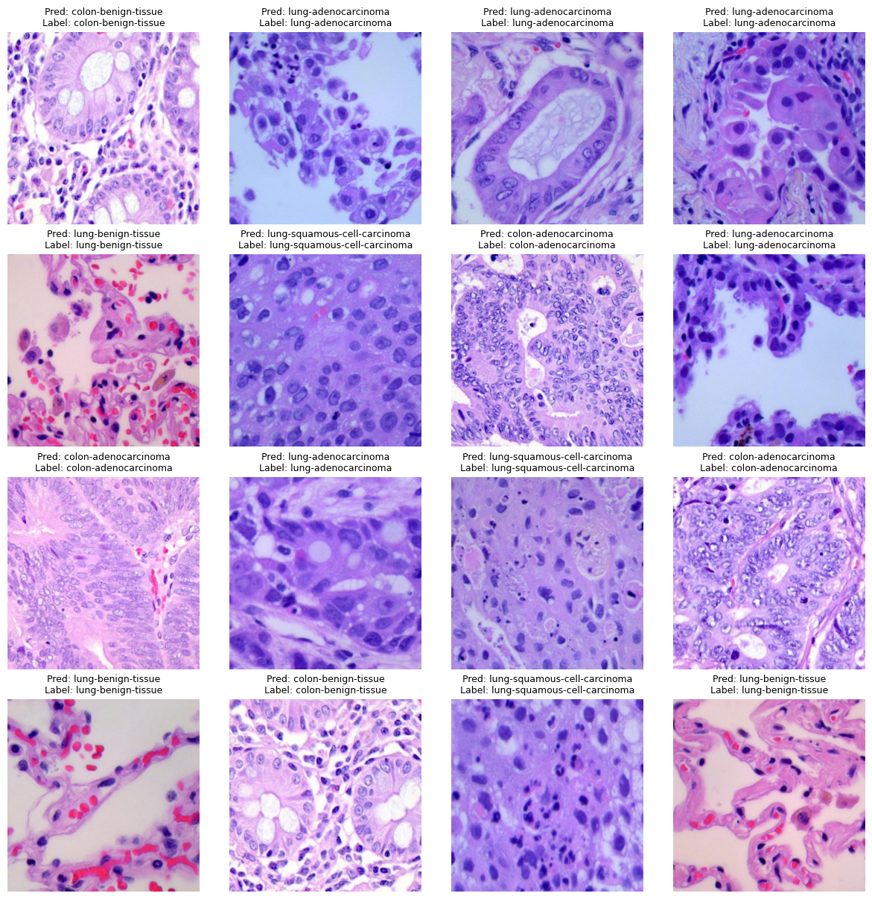
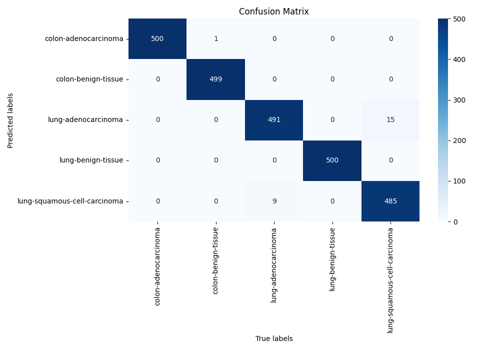

# Lung and Colon Cancer Classification


## About Dataset

This dataset contains 25,000 histopathological images with 5 classes. All images are 768 x 768 pixels in size and are in jpeg file format.
The images were generated from an original sample of HIPAA compliant and validated sources, consisting of 750 total images of lung tissue (250 benign lung tissue, 250 lung adenocarcinomas, and 250 lung squamous cell carcinomas) and 500 total images of colon tissue (250 benign colon tissue and 250 colon adenocarcinomas) and augmented to 25,000 using the Augmentor package.
There are five classes in the dataset, each with 5,000 images, being:

- Lung benign tissue
- Lung adenocarcinoma
- Lung squamous cell carcinoma
- Colon adenocarcinoma
- Colon benign tissue

How to Cite this Dataset
If you use in your research, please credit the author of the dataset:

Original Article
Borkowski AA, Bui MM, Thomas LB, Wilson CP, DeLand LA, Mastorides SM. Lung and Colon Cancer Histopathological Image Dataset (LC25000). arXiv:1912.12142v1 [eess.IV], 2019

Relevant Links
https://arxiv.org/abs/1912.12142v1
https://github.com/tampapath/lung_colon_image_set
Dataset BibTeX
@article{,
title= {LC25000 Lung and colon histopathological image dataset},
keywords= {cancer,histopathology},
author= {Andrew A. Borkowski, Marilyn M. Bui, L. Brannon Thomas, Catherine P. Wilson, Lauren A. DeLand, Stephen M. Mastorides},
url= {https://github.com/tampapath/lung_colon_image_set}
}

## 🛠️ Technologies Used

**UV:** Environment management.
**Optuna** for hyperparameter tuning.
**Hydra:** For managing complex configurations.
**Jupyter Notebook:** For exploratory data analysis (EDA), model development, and training.
**AWS:** `IAM`, `S3`, `ECR (Amazon Elastic Container Registry)`, `EC2` for cloud infrastructure, model storage, and deployment.
**FastAPI:** For building the high-performance prediction API (`app/app.py`).
**Docker:** Containerization for consistent environment.
**Kubernetes (Kind):** For local Kubernetes deployment and testing (kubernets-kind.md)
**GitHub Actions:** CI/CD automation.

## Project Workflow





## Project Structure

```tree
├── app/
│   ├── app.py
│   ├── fetch_model_s3.py
│   ├── __init__.py
│   └── templates/
│       └── index.html
├── configs/
│   ├── callbacks/
│   │   ├── default.yaml
│   │   ├── early_stopping.yaml
│   │   ├── learning_rate_monitor.yaml
│   │   ├── model_checkpoint.yaml
│   │   ├── model_summary.yaml
│   │   ├── none.yaml
│   │   └── rich_progress_bar.yaml
│   ├── data/
│   │   ├── default.yaml
│   │   ├── lung_colon_cancer_images.yaml
│   │   └── preprocessor.yaml
│   ├── datamodule/
│   │   ├── default.yaml
│   │   └── lung_colon_datamodule.yaml
│   ├── eval.yaml
│   ├── experiment/
│   │   └── find_cnn_layers.yaml
│   ├── extras/
│   │   └── default.yaml
│   ├── hparams_search/
│   │   └── cnn_layers_search_optuna.yaml
│   ├── hydra/
│   │   └── default.yaml
│   ├── logger/
│   │   ├── csv.yaml
│   │   ├── mlflow_logger.yaml
│   │   └── tensorboard.yaml
│   ├── model/
│   │   ├── default.yaml
│   │   └── lung_colon_cancer_classifier.yaml
│   ├── paths/
│   │   └── default.yaml
│   ├── trainer/
│   │   └── default.yaml
│   └── train.yaml
├── Dockerfile
├── docs/
│   └── kubernets-kind.md
├── .env
├── .github/
│   └── workflows/
│       └── ci.yaml
├── kind-deployment.yaml
├── notebooks/
├── pyproject.toml
├── README.md
├── src/
│   ├── cloud_storage/
│   │   ├── aws_storage.py
│   │   └── __init__.py
│   ├── connections/
│   │   ├── aws_connection.py
│   │   └── __init__.py
│   ├── data/
│   │   ├── data_processor.py
│   │   ├── data_split.py
│   │   └── __init__.py
│   ├── datamodule/
│   │   ├── __init__.py
│   │   └── lung_colon_cancer_datamodule.py
│   ├── entity/
│   │   ├── aws_secrets.py
│   │   ├── best_cnn_model.py
│   │   ├── __init__.py
│   │   └── s3_classifier.py
│   ├── eval.py
│   ├── model/
│   │   ├── __init__.py
│   │   └── lung_colon_cancer_classifier.py
│   ├── prediction.py
│   ├── train.py
│   └── utils/
│       ├── download_kaggel_ds.py
│       ├── __init__.py
│       ├── instantiators.py
│       ├── logging_utils.py
│       ├── pylogger.py
│       ├── rich_utils.py
│       └── utils.py
├── tests/
│   ├── __init__.py
│   └── model/
│       ├── __init__.py
│       └── test_custom_net.py
├── uv.lock
```

### Model Training Pipeline

### CI/CD Pipeline

## 🔧 Setup & Installation

1. **Clone the repository:**

   ```bash
   git clone https://github.com/vivekpatel99/lung-and-colon-cancer-classification-pytorch.git
   cd heart-attack-predictor-end-to-end-ml-project
   ```

   *(Note: The project structure is assumed to be pre-generated, potentially using a `template.py` script as mentioned in development steps.)*

2. **Create and Activate Virtual Environment (using `uv`)/Setup Project Environment:**

   *First, ensure you have `uv` installed. If not, follow the instructions here.*

   ```bash
   # uv will create a virtual environment named .venv and install dependencies
   uv sync
   ```

3. **Set up AWS:**

   - **IAM User (Example):**
     - Go to IAM > Users > Create user (e.g., `cancer-classifier-dev-user`).
     - Attach policies: `AdministratorAccess` (for ease of setup, consider more restrictive policies for production).
     - Create access key (select "Command Line Interface (CLI)") and download/copy the `AWS_ACCESS_KEY_ID` and `AWS_SECRET_ACCESS_KEY`.
   - **S3 Bucket (Example):**
     - Go to S3 > Create bucket.
     - Choose a unique bucket name (e.g., `yourname-cancer-classifier-models`).
     - Select the region (e.g., `us-east-1`).
     - Uncheck "Block all public access" and acknowledge (needed for simple deployment setup; review security implications).
     - Create the bucket.

4. **Set up Environment Variables:**

   - **Method 1: `.env` file (Recommended for Local Development)**

     - Create a `.env` file in the project root.
     - Add your credentials and configurations:

     ```dotenv
     # .env
      # --- Dataset ---
      KAGGLE_USERNAME=
      KAGGLE_KEY=

      # --- DAGSHUB ---
      DAGSHUB_REPO_OWNER=
      DAGSHUB_REPO_NAME=
      DAGSHUB_TRACKING_URI=
      DAGSHUB_USER_TOKEN=
      # --- AWS IAM ---
      AWS_ACCESS_KEY_ID=
      AWS_SECRET_ACCESS_KEY=
      AWS_S3_BUCKET_NAME=
      AWS_S3_REGION_NAME=

      # --- AWS ECR ---
      AWS_ECR_NAME=

     ```

     - *Note: Ensure `.env` is listed in your `.gitignore` file. If you are using `uv run`, `uv` will automatically load variables from a `.env` file in the current or parent directories, so manual exporting might not be necessary when running scripts via `uv run`.*
     - The application code needs to be configured to load variables from `.env` (e.g., using `python-dotenv`).

   - **Method 2: Exporting Variables (Common for Terminals/CI/CD)**

     - **Bash/Zsh:**

     ```bash
     export MONGODB_URL="mongodb+srv://<username>:<password>@..."
     export AWS_ACCESS_KEY_ID="YOUR_AWS_ACCESS_KEY_ID"
     export AWS_SECRET_ACCESS_KEY="YOUR_AWS_SECRET_ACCESS_KEY"
     export AWS_REGION="us-east-1"
     # Check: echo $MONGODB_URL
     ```

     - **PowerShell:**

     ```powershell
     $env:MONGODB_URL = "mongodb+srv://<username>:<password>@..."
     $env:AWS_ACCESS_KEY_ID = "YOUR_AWS_ACCESS_KEY_ID"
     $env:AWS_SECRET_ACCESS_KEY = "YOUR_AWS_SECRET_ACCESS_KEY"
     $env:AWS_REGION = "us-east-1"
     # Check: echo $env:MONGODB_URL
     ```

     - **Windows CMD (or System Environment Variables GUI):**

     ```cmd
     set MONGODB_URL="mongodb+srv://<username>:<password>@..."
     set AWS_ACCESS_KEY_ID="YOUR_AWS_ACCESS_KEY_ID"
     # ... etc
     ```

5. **Run the Project**

   ```bash
   uv run fastapi run app.py
   ```

6. **Push new changes to AWS**

   - First uncomment code from [Github Actions](.github/workflows/aws.yaml) for AWS.
   - the commit and push your changes. Github Action will automatically build and deploy project on `EC2` instance.

## 💾 Data Handling

- **Dataset Loading:** The initial dataset (from Kaggle) should be placed appropriately (e.g., in a `data/` or `notebooks/` directory).
- **MongoDB Upload:** Use the provided Jupyter notebook (e.g., `notebooks/mongoDB_demo.ipynb`) to upload the dataset to your configured MongoDB Atlas database.
- **Data Ingestion:** The pipeline's `DataIngestion` component reads data from MongoDB.

## 🏋️ Running the Training Pipeline

- Ensure your environment variables are set correctly (MongoDB URL, AWS Keys).
- Execute the main training pipeline script (e.g., `python main.py` or `python demo.py` - adjust command based on your project's entry point).
- This script orchestrates the following components:
  1. **Data Ingestion:** Fetches data from MongoDB.
  2. **Data Validation:** Checks data against a predefined schema (`config/schema.yaml`).
  3. **Data Transformation:** Performs preprocessing and feature engineering.
  4. **Model Training:** Trains the machine learning model.
  5. **Model Evaluation:** Evaluates the trained model against metrics and potentially a baseline model from S3.
  6. **Model Pusher:** If the model meets evaluation criteria, pushes the model artifacts (model file, preprocessor) to the configured AWS S3 bucket.

## 📈 Results & Visualizations



- final testing Result after model training

```
┏━━━━━━━━━━━━━━━━━━━━━━━━━━━┳━━━━━━━━━━━━━━━━━━━━━━━━━━━┓
┃        Test metric        ┃       DataLoader 0        ┃
┡━━━━━━━━━━━━━━━━━━━━━━━━━━━╇━━━━━━━━━━━━━━━━━━━━━━━━━━━┩
│         test/acc          │            1.0            │
│       test/f1_score       │            1.0            │
│         test/loss         │  0.00015993608394637704   │
└───────────────────────────┴───────────────────────────┘
```

### Classification Report

| Class                        | Precision | Recall    | F1-Score  | Support  |
| ---------------------------- | --------- | --------- | --------- | -------- |
| colon-adenocarcinoma         | 0.998     | 1.000     | 0.999     | 500      |
| colon-benign-tissue          | 1.000     | 0.998     | 0.999     | 500      |
| lung-adenocarcinoma          | 0.970     | 0.982     | 0.976     | 500      |
| lung-benign-tissue           | 1.000     | 1.000     | 1.000     | 500      |
| lung-squamous-cell-carcinoma | 0.982     | 0.970     | 0.976     | 500      |
|                              |           |           |           |          |
| **Accuracy**                 |           |           | **0.990** | **2500** |
| **Macro Avg**                | **0.990** | **0.990** | **0.990** | **2500** |
| **Weighted Avg**             | **0.990** | **0.990** | **0.990** | **2500** |

### Confusion Matrix



## 🖥️ Hardware Specifications

NOTE: To enhance ball detection accuracy, the YOLOv12L model was trained using an image size of 1280x1280. Training was performed using Lightning Studio to ensure sufficient GPU memory was available. The project was developed and tested on the following hardware:
it was developed and tested on the following hardware:

- **CPU:** AMD Ryzen 5900X
- **GPU:** NVIDIA GeForce RTX 3080 (10GB VRAM)
- **RAM:** 32 GB DDR4

While these specifications are recommended for optimal performance, the project can be adapted to run on systems with less powerful hardware.

## 📚 Reference

1. [hydra-example-project](https://github.com/FlorianWilhelm/hydra-example-project)
2. [Lung and Colon Cancer Histopathological Images](https://www.kaggle.com/datasets/andrewmvd/lung-and-colon-cancer-histopathological-images/data)

## Found Bugs/Issues

1. Pytorch Lightning - MLFlowLogger: while saving the model (fails to log artifact) -[issue](https://github.com/Lightning-AI/pytorch-lightning/issues/20664)
